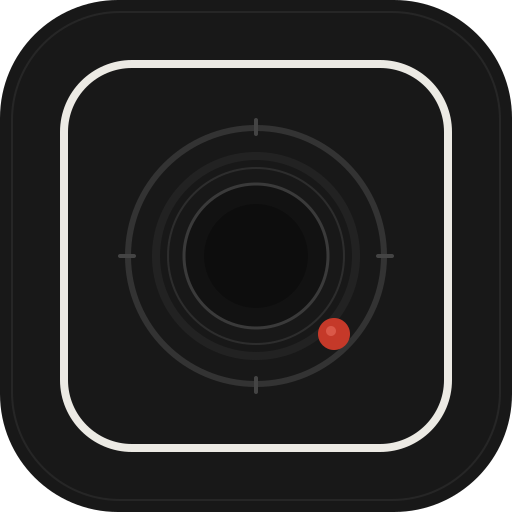

# FRAME 01

<div align="center">
  
  <br />
  <strong>Not a feed. A frame.</strong>
  <br />
  <em>A private home for your photographs. Photography, without the performance.</em>
</div>

---

## 1. O Ícone do FRAME

O ícone do **FRAME** foi desenhado seguindo a filosofia *quiet luxury + editorial photography*:
- **Base Squircle em Charcoal Fosco (`#181818`)**: Remete ao corpo metálico e revestimento texturizado de câmeras rangefinder clássicas (Leica M, Contax T).
- **Moldura Fina em Branco Quente (`#ECEAE4`)**: Simula a borda de uma ampliação fotográfica de museu em papel algodão 300gsm.
- **Anel Mecânico de Abertura**: Gravado com marcadores e anéis concêntricos de lente óptica analógica.
- **Ponto Vermelho Óptico (`#C53929`)**: O clássico acento sutil de precisão óptica alemã.

Arquivos de ícone inclusos no repositório:
- [`favicon.svg`](./favicon.svg) — Vetor SVG de alta fidelidade para abas de navegadores e marcadores.
- [`icon.svg`](./icon.svg) — Ícone vetorial escalável para web e mobile.
- [`manifest.json`](./manifest.json) — Manifesto PWA para permitir instalação como aplicativo nativo em celulares e desktops.

---

## 2. Por que a tela ficava branca anteriormente?

Ao abrir um projeto padrão do Vite/React dando duplo clique diretamente no arquivo `index.html` pelo Windows Explorer (protocolo `file:///`), o navegador:
1. Bloqueia a resolução de scripts com barra inicial como `/src/main.tsx` (procura no disco `C:\src\main.tsx`).
2. Não interpreta a sintaxe de arquivos TypeScript JSX (`.tsx`) diretamente sem um compilador ou servidor de desenvolvimento rodando.
3. Bloqueia módulos locais por políticas de segurança CORS do navegador.

---

## 3. A Solução do "Frame 01"

O **Frame 01** possui uma arquitetura **zero-build e 100% autossuficiente**:
- Funciona **instantaneamente com duplo clique no `index.html`** em qualquer navegador (Edge, Chrome, Firefox, Safari), abrindo via `file:///` sem jamais ficar em tela branca.
- Não necessita de servidores locais, terminal ou comandos para funcionar.
- Preserva todas as funcionalidades do briefing:
  - **TODAY**: Composição editorial dinâmica assimétrica, micro-rotações táteis, horários (`11:42`, `17:32`), Polaroids e *On This Day*.
  - **COLLECTIONS**: Álbuns com capas, contagem de fotos, período e alternância entre *Editorial*, *Grid* e *Film*.
  - **BOARDS**: Superfície digital espacial onde você **arrasta elementos com o mouse**, rotaciona, duplica, deleta e **trava (Lock)**.
  - **MIX ENGINE**: Algoritmo generativo com 6 presets (*Calm*, *Editorial*, *Wall*, *Contact*, *Messy*, *Polaroid*) que preserva os elementos bloqueados!
  - **JOURNAL**: Diário visual em formato de livro fotográfico com momentos e notas.
  - **ARCHIVE**: Catálogo mestre com visualizações de *Contact Sheet* 35mm com numeração de quadro, *Timeline*, *Film Strip*, *Editorial* e *Grid*.
  - **EXIF & DETALHE**: Visualizador de tela cheia com gaveta técnica completa (câmera, lente, abertura, velocidade, ISO).
  - **SHARE AS IMAGE**: Renderizador em HTML5 Canvas de alta resolução exportando PNG em proporções *Square 1:1*, *Story 9:16* e *Landscape 16:9*.
  - **PRINTED**: Estante de fotolivros físicos encadernados.
  - **DARKROOM THEME**: Alternância entre papel de algodão e safelight analógico.

---

## 4. Como Adicionar ao GitHub e Publicar Online Gratuitamente (GitHub Pages)

Como este projeto é puramente estático e autossuficiente, você pode colocá-lo no GitHub e ter um link online funcionando em menos de 2 minutos:

### Passo 1: Criar o Repositório no GitHub
1. Acesse [github.com/new](https://github.com/new).
2. Dê o nome ao repositório (por exemplo: `frame` ou `frame-app`).
3. Escolha **Public** e clique em **Create repository**.

### Passo 2: Subir os arquivos pelo Git (Terminal)
Abra o terminal na pasta do projeto:
```bash
git init
git add .
git commit -m "feat: initial commit of FRAME 01"
git branch -M main
git remote add origin https://github.com/SEU_USUARIO/SEU_REPOSITORIO.git
git push -u origin main
```
*(Ou se preferir sem terminal, basta arrastar os arquivos da pasta `Frame 01` diretamente na interface web do GitHub).*

### Passo 3: Ativar o GitHub Pages (Site no Ar)
1. No seu repositório no GitHub, clique na aba **Settings** (Configurações).
2. No menu lateral esquerdo, clique em **Pages**.
3. Em **Build and deployment > Source**, selecione:
   - Branch: `main`
   - Folder: `/ (root)`
4. Clique em **Save**.
5. Pronto! Em 1 minuto o GitHub vai gerar o link público da sua galeria:  
   `https://SEU_USUARIO.github.io/SEU_REPOSITORIO/`

---

## 5. Licença

Distribuído sob a licença [MIT](./LICENSE).
